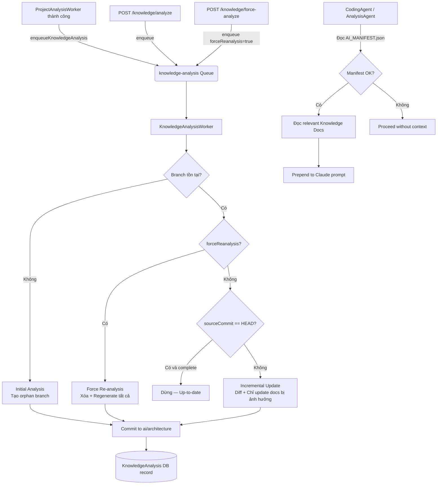

# Design Document — AI Architecture Knowledge Branch

## Overview

Feature này mở rộng hệ thống WebWow để duy trì một **Knowledge Branch** (`ai/architecture`) trên mỗi repository của khách hàng — một tập hợp tài liệu Markdown version-controlled mô tả kiến trúc dự án, được tạo và cập nhật tự động bởi AI.

Thay vì gửi toàn bộ repository cho Claude mỗi lần agent cần hiểu project, các agent (CodingAgent, AnalysisAgent) sẽ đọc từ Knowledge Branch trước, sau đó chỉ fetch source files cần thiết cho task hiện tại. Điều này giảm đáng kể token usage và cải thiện chất lượng output vì Claude được cung cấp context có cấu trúc thay vì raw code.

**Phạm vi v1:**
- Knowledge Branch lifecycle: tạo mới (orphan branch), cập nhật incremental, force re-analysis
- Tích hợp vào BullMQ pipeline (trigger sau `ProjectAnalysisWorker` hoàn tất)
- REST endpoints để UI trigger và poll status
- CodingAgent/AnalysisAgent đọc knowledge trước khi bắt đầu task
- Architecture tab frontend hiển thị status và cho phép trigger thủ công

**Ngoài phạm vi v1:** Vector database, embeddings, RAG, webhook-triggered auto-update, autonomous PR creation.

---

## Architecture

### High-Level Flow



### Module Structure (Backend)

```
src/
├── modules/
│   └── knowledge/                    ← NEW module
│       ├── knowledge.module.ts
│       ├── knowledge.controller.ts   ← 3 endpoints: analyze, force-analyze, status
│       ├── knowledge.service.ts      ← Orchestration + duplicate-job guard
│       ├── dto/
│       │   └── knowledge-status.dto.ts
│       └── types/
│           └── knowledge.types.ts    ← AIManifest, DocumentStatus interfaces
├── queue/
│   ├── workers/
│   │   └── knowledge-analysis.worker.ts  ← NEW @Processor('knowledge-analysis')
│   ├── queue.constants.ts            ← MODIFIED: thêm KNOWLEDGE_ANALYSIS
│   ├── queue.service.ts              ← MODIFIED: thêm enqueueKnowledgeAnalysis()
│   └── queue.types.ts                ← MODIFIED: thêm KnowledgeAnalysisJobData
├── ai/
│   ├── agents/
│   │   ├── coding.agent.ts           ← MODIFIED: đọc knowledge branch trước
│   │   ├── analysis.agent.ts         ← MODIFIED: đọc knowledge branch trước
│   │   └── knowledge-reader.agent.ts ← NEW: tái sử dụng bởi cả 2 agents
│   └── prompts/
│       └── knowledge.prompt.ts       ← NEW: prompts cho document generation
└── prisma/
    └── schema.prisma                 ← MODIFIED: thêm KnowledgeAnalysis model
```

---

## Components and Interfaces

### 1. KnowledgeAnalysisWorker (`src/queue/workers/knowledge-analysis.worker.ts`)

BullMQ worker chính, follow đúng pattern của `ProjectAnalysisWorker`:

```typescript
@Processor(QUEUES.KNOWLEDGE_ANALYSIS, { concurrency: CONCURRENCY.KNOWLEDGE_ANALYSIS })
export class KnowledgeAnalysisWorker extends WorkerHost {
  async process(job: Job<KnowledgeAnalysisJobData>): Promise<void> {
    // 1. Upsert KnowledgeAnalysis record → RUNNING
    // 2. Fetch manifest from GitHub (GithubService.getFileContent)
    // 3. Route: initial | incremental | force | no-op
    // 4. Execute analysis flow
    // 5. Commit documents to ai/architecture
    // 6. Update KnowledgeAnalysis record → COMPLETE/PARTIAL/FAILED
  }
}
```

**Retry policy**: 3 attempts, exponential backoff 30s → 60s → 120s (identical to `ProjectAnalysisWorker`).

### 2. KnowledgeService (`src/modules/knowledge/knowledge.service.ts`)

Xử lý HTTP-level logic (authorization, duplicate-job detection) trước khi enqueue:

```typescript
@Injectable()
export class KnowledgeService {
  async enqueueAnalysis(projectId: string, organizationId: string, force: boolean): Promise<void>
  async getStatus(projectId: string, organizationId: string): Promise<KnowledgeStatusDto>
  private async checkRunning(projectId: string): Promise<boolean>
}
```

### 3. KnowledgeController (`src/modules/knowledge/knowledge.controller.ts`)

```
POST /api/projects/:projectId/knowledge/analyze       → HTTP 202 / 409
POST /api/projects/:projectId/knowledge/force-analyze → HTTP 202 / 409
GET  /api/projects/:projectId/knowledge/status        → KnowledgeStatusDto
```

Tất cả endpoints: `@UseGuards(JwtAuthGuard)`, validate `organizationId` ownership.

### 4. KnowledgeReaderAgent (`src/ai/agents/knowledge-reader.agent.ts`)

Shared helper cho CodingAgent và AnalysisAgent:

```typescript
@Injectable()
export class KnowledgeReaderAgent {
  async readForCodingTask(
    owner: string, repo: string, organizationId: string
  ): Promise<KnowledgeContext | null>

  async readForAnalysisTask(
    owner: string, repo: string, organizationId: string
  ): Promise<KnowledgeContext | null>
}

interface KnowledgeContext {
  manifestStatus: 'complete' | 'partial' | 'failed';
  documents: Record<string, string>; // filename → content
  promptSection: string;             // Pre-formatted cho Claude prompt
}
```

### 5. GithubService Extensions

Cần thêm 3 methods mới vào `GithubService`:

```typescript
// Tạo orphan branch (không có parent commit)
async createOrphanBranch(
  organizationId: string, owner: string, repo: string, branchName: string
): Promise<void>

// Đọc nội dung một file từ branch cụ thể
async getFileContent(
  organizationId: string, owner: string, repo: string,
  path: string, ref: string
): Promise<string | null>

// Lấy diff giữa 2 commits
async getCommitDiff(
  organizationId: string, owner: string, repo: string,
  baseCommit: string, headCommit: string
): Promise<string[]> // list of changed file paths

// Xóa nhiều files khỏi một branch trong một commit
async deleteFiles(
  organizationId: string, owner: string, repo: string,
  branch: string, filePaths: string[], message: string
): Promise<void>

// Lấy HEAD SHA của một branch
async getBranchHeadSha(
  organizationId: string, owner: string, repo: string, branch: string
): Promise<string | null>
```

---

## Data Models

### Prisma: KnowledgeAnalysis Model

Thêm vào `prisma/schema.prisma`:

```prisma
enum KnowledgeAnalysisStatus {
  PENDING
  RUNNING
  COMPLETE
  PARTIAL
  FAILED
}

model KnowledgeAnalysis {
  id                  String                  @id @default(uuid())
  projectId           String                  @unique
  organizationId      String

  analysisStatus      KnowledgeAnalysisStatus @default(PENDING)
  lastAnalyzedCommit  String?                 // sourceCommit từ AI_Manifest
  lastAnalyzedAt      DateTime?               // timestamp của lần complete/partial cuối
  lastErrorMessage    String?                 // ≤ 500 chars, tiếng Việt, hiển thị UI

  createdAt           DateTime                @default(now())
  updatedAt           DateTime                @updatedAt

  project             Project                 @relation(fields: [projectId], references: [id])

  @@index([organizationId])
  @@index([projectId])
}
```

Thêm relation vào model `Project`:
```prisma
knowledgeAnalysis    KnowledgeAnalysis?
```

### TypeScript Interfaces

```typescript
// src/modules/knowledge/types/knowledge.types.ts

export const KNOWLEDGE_BRANCH = 'ai/architecture';
export const AI_MANIFEST_PATH = 'AI_MANIFEST.json';

export const KNOWLEDGE_DOCUMENTS = [
  'PROJECT.md', 'ARCHITECTURE.md', 'MODULES.md', 'API.md',
  'DATABASE.md', 'DEPENDENCIES.md', 'CONVENTIONS.md',
  'BUSINESS_RULES.md', 'FILE_INDEX.md',
] as const;
export type KnowledgeDocumentName = typeof KNOWLEDGE_DOCUMENTS[number];

export type DocumentStatus = 'complete' | 'not_applicable' | 'failed';
export type ManifestStatus = 'complete' | 'partial' | 'failed';

export interface AIManifest {
  schemaVersion: number;           // ≥ 1
  status: ManifestStatus;
  knowledgeBranch: 'ai/architecture';
  sourceBranch: string;
  sourceCommit: string;            // 40-char SHA
  analyzedAt: string;              // ISO 8601
  documents: Record<KnowledgeDocumentName, {
    status: DocumentStatus;
    lastUpdatedCommit: string;
  }>;
}

export interface KnowledgeAnalysisJobData {
  projectId: string;
  organizationId: string;
  forceReanalysis: boolean;
  triggeredBy: 'user' | 'system';
}

export interface KnowledgeStatusDto {
  analysisStatus: KnowledgeAnalysisStatus;
  lastAnalyzedCommit: string | null;
  lastAnalyzedAt: string | null;    // ISO 8601
  lastErrorMessage: string | null;
  alreadyUpToDate?: boolean;        // true khi không cần AI call
  documents?: Record<KnowledgeDocumentName, { status: DocumentStatus }>;
}
```

### Change-to-Document Mapping

```typescript
// src/modules/knowledge/types/knowledge.types.ts

export const CHANGE_MAPPING: Array<{
  test: (path: string) => boolean;
  documents: KnowledgeDocumentName[];
}> = [
  {
    test: (p) => p === 'prisma/schema.prisma' || p.startsWith('prisma/migrations/'),
    documents: ['DATABASE.md'],
  },
  {
    test: (p) => p.toLowerCase().includes('controller') || p.startsWith('src/api/') || p.startsWith('src/routes/'),
    documents: ['API.md'],
  },
  {
    test: (p) => p === 'package.json' || p.endsWith('/package.json'),
    documents: ['DEPENDENCIES.md'],
  },
  {
    test: (p) => /^\.eslintrc|^tsconfig\.json|prettier\.config/.test(p),
    documents: ['CONVENTIONS.md'],
  },
  {
    test: (p) => p.startsWith('src/'),
    documents: ['ARCHITECTURE.md', 'MODULES.md'],
  },
];

/**
 * Trả về danh sách documents cần regenerate từ danh sách files thay đổi.
 * Priority: first matching rule wins per file.
 */
export function mapChangesToDocuments(
  changedPaths: string[]
): Set<KnowledgeDocumentName> {
  const result = new Set<KnowledgeDocumentName>();
  for (const path of changedPaths) {
    for (const rule of CHANGE_MAPPING) {
      if (rule.test(path)) {
        rule.documents.forEach(d => result.add(d));
        break; // first match wins
      }
    }
  }
  return result;
}
```

---

## Correctness Properties

*A property is a characteristic or behavior that should hold true across all valid executions of a system — essentially, a formal statement about what the system should do. Properties serve as the bridge between human-readable specifications and machine-verifiable correctness guarantees.*

### Property 1: Manifest–File Consistency

*For any* completed analysis result, the set of files committed to the Knowledge Branch should contain exactly the Knowledge Documents whose status is `"complete"` in the AI_Manifest — no more, no fewer.

**Validates: Requirements 1.1, 1.4**

---

### Property 2: AI_Manifest Schema Conformance

*For any* analysis run (initial, incremental, or force), the generated AI_Manifest JSON should conform to the specified schema: valid `schemaVersion ≥ 1`, `status` is one of `complete/partial/failed`, `sourceCommit` is a 40-character hex SHA, `analyzedAt` is a valid ISO 8601 string, and each document entry has a valid `status` and `lastUpdatedCommit`.

**Validates: Requirements 1.3**

---

### Property 3: Change-to-Document Mapping Determinism

*For any* set of changed file paths, `mapChangesToDocuments()` should return a deterministic, consistent set of document names — applying first-matching-rule-wins semantics such that: (1) prisma paths → only `DATABASE.md`; (2) controller/api paths → only `API.md`; (3) `package.json` → only `DEPENDENCIES.md`; (4) config files → only `CONVENTIONS.md`; (5) remaining `src/**` → `ARCHITECTURE.md` and `MODULES.md`. A file should never produce document assignments from two different rules.

**Validates: Requirements 3.3**

---

### Property 4: Analysis Status State Machine

*For any* analysis run lifecycle, the `KnowledgeAnalysis` record's `analysisStatus` transitions should follow the valid state machine: PENDING → RUNNING → (COMPLETE | PARTIAL | FAILED). No analysis run should leave the record in RUNNING state after completing. A successful analysis sets `lastAnalyzedCommit` to a non-null SHA.

**Validates: Requirements 2.4, 2.5, 4.5**

---

### Property 5: No-Op Guard — Idempotence When Up-to-Date

*For any* project where the AI_Manifest status is `"complete"` AND all per-document statuses are `"complete"` AND `sourceCommit` equals the current HEAD SHA, executing a knowledge analysis should make zero Claude API calls and zero Git commits.

**Validates: Requirements 3.1, 5.3**

---

### Property 6: Incremental Scoping — Claude Called Only for Mapped Documents

*For any* incremental analysis with a non-empty set of changed files, Claude should be called exactly for the documents identified by `mapChangesToDocuments()` — neither more (no extra documents) nor fewer (no skipped mapped documents).

**Validates: Requirements 3.4, 5.2**

---

### Property 7: Secret Exclusion from Claude Context

*For any* repository file tree containing files matching the excluded patterns (`.env`, `.env.*`, `*.pem`, `*.key`, `*secret*`, `*credential*`), none of those files should appear in the set of files passed to Claude when generating any Knowledge Document.

**Validates: Requirements 6.1**

---

### Property 8: Secret Masking Before Claude

*For any* source file content containing strings matching the `SECRET_PATTERNS` regexes (`sk-[a-zA-Z0-9]{20,}`, `ghp_[a-zA-Z0-9]{36}`, high-entropy base64 ≥ 40 chars), the masked version passed to Claude should replace all matches with `[MASKED]`.

**Validates: Requirements 6.2**

---

### Property 9: ActivityLog Credential Safety

*For any* `ActivityLog` entry created by `KnowledgeAnalysisWorker`, the `friendlyMessage`, `technicalDetail`, and all string fields should not contain strings matching GitHub installation token patterns (`ghs_`), OpenAI key patterns (`sk-`), or any value matching the `SECRET_PATTERNS`.

**Validates: Requirements 6.3**

---

### Property 10: DEPENDENCIES.md Content Constraint

*For any* `package.json` input with a `dependencies` object, the generated `DEPENDENCIES.md` content should contain only package names and their declared version strings — it should not contain any URL patterns (`https://`, `http://`), integrity hash patterns (`sha512-`), or lockfile content.

**Validates: Requirements 6.4**

---

### Property 11: Agent Document Selection Correctness

*For any* AI_Manifest with `status: "complete"`, the set of Knowledge Documents read by an agent should match exactly the specification: coding tasks read `{PROJECT.md, ARCHITECTURE.md, MODULES.md, FILE_INDEX.md}` (minus any `not_applicable`); analysis tasks read `{PROJECT.md, ARCHITECTURE.md, MODULES.md, API.md, BUSINESS_RULES.md}` (minus any `not_applicable`). No extra documents should be fetched.

**Validates: Requirements 9.2, 9.4**

---

### Property 12: Required Document Sections

*For any* repository analysis input, each generated Knowledge Document should contain all mandatory sections specified in Requirement 12: `PROJECT.md` must have `## Overview`, `## Technology Stack`, `## Entry Points`; `ARCHITECTURE.md` must have `## Directory Structure`, `## Architectural Patterns`, `## Module Interactions`. Each document must begin with the correct `# DOCUMENT_NAME` H1 heading.

**Validates: Requirements 12.1, 12.2, 12.9**

---

## Error Handling

### Worker-Level Error Handling

```typescript
// KnowledgeAnalysisWorker.process() — unified error handling pattern
try {
  await this.prisma.knowledgeAnalysis.upsert({
    where: { projectId },
    create: { projectId, organizationId, analysisStatus: 'RUNNING' },
    update: { analysisStatus: 'RUNNING' },
  });

  // ... analysis logic ...

  await this.prisma.knowledgeAnalysis.update({
    where: { projectId },
    data: { analysisStatus: 'COMPLETE', lastAnalyzedCommit: headSha, lastAnalyzedAt: new Date() },
  });
} catch (err) {
  const errorMessage = buildVietnameseError(err); // ≤ 500 chars
  
  await this.prisma.knowledgeAnalysis.update({
    where: { projectId },
    data: { analysisStatus: 'FAILED', lastErrorMessage: errorMessage },
  }).catch(() => {}); // DB error không block throw

  throw err; // Re-throw để BullMQ handle retry
}
```

### Partial Failure Handling

Khi một document generation thất bại trong Initial/Force analysis:
1. Tiếp tục generate các documents còn lại
2. Commit tất cả documents đã hoàn thành
3. Ghi AI_Manifest với `status: "partial"` và per-document `status: "failed"` cho doc thất bại
4. Set `KnowledgeAnalysis.analysisStatus = 'PARTIAL'`

### GithubService Failure Modes

| Scenario | Hành vi |
|---|---|
| Branch không tồn tại (404) | Route sang Initial Analysis |
| AI_Manifest không đọc được | Route sang Initial Analysis |
| `getCommitDiff()` thất bại | Abort incremental, set FAILED |
| `sourceCommit` không reachable | Abort incremental, set FAILED |
| `commitFiles()` thất bại | Retry (BullMQ handles), sau max retries → FAILED |
| GithubService timeout | Retry via BullMQ backoff |

### Vietnamese Error Messages

```typescript
function buildVietnameseError(err: unknown, context?: string): string {
  const base = context ? `[${context}] ` : '';
  if (err instanceof Error) {
    if (err.message.includes('Not Found') || err.message.includes('404')) {
      return `${base}Không tìm thấy repository hoặc branch. Kiểm tra cấu hình GitHub.`;
    }
    if (err.message.includes('rate limit')) {
      return `${base}GitHub API bị giới hạn tốc độ. Vui lòng thử lại sau.`;
    }
    if (err.message.includes('timeout')) {
      return `${base}Hết thời gian chờ khi kết nối GitHub. Vui lòng thử lại.`;
    }
  }
  return `${base}Phân tích kiến trúc thất bại. Vui lòng kiểm tra kết nối GitHub và thử lại.`;
}
```

---

## Testing Strategy

### Dual Testing Approach

Feature này phù hợp cho property-based testing (PBT) vì các hàm core (`mapChangesToDocuments`, secret masking, document generation, manifest schema) là pure functions với input space rộng.

**PBT Library:** `fast-check` (đã có trong ecosystem TypeScript/NestJS, được sử dụng rộng rãi với Jest).

### Unit Tests — Specific Examples

- `KnowledgeAnalysisWorker`: test các flow routing (initial/incremental/force/no-op), error handling, status transitions
- `KnowledgeService`: test duplicate-job detection, 409 conflict response, authorization check
- `KnowledgeReaderAgent`: test manifest parsing, document selection logic, fallback behavior
- `GithubService` extensions: test orphan branch creation, diff retrieval
- Document generators: test required sections, 500-line truncation

### Property-Based Tests (fast-check, min 100 iterations each)

Mỗi property test được tag theo format: `Feature: ai-architecture-knowledge-branch, Property N: <text>`

**Property 1: Manifest–File Consistency**
```typescript
// Feature: ai-architecture-knowledge-branch, Property 1: Manifest-file consistency
it('committed files match complete documents in manifest', () => {
  fc.assert(fc.property(
    fc.record({ documents: fc.dictionary(fc.constantFrom(...KNOWLEDGE_DOCUMENTS), fc.constantFrom('complete', 'not_applicable', 'failed')) }),
    (manifest) => {
      const committed = getFilesFromManifest(manifest);
      const expected = Object.entries(manifest.documents)
        .filter(([, v]) => v.status === 'complete')
        .map(([k]) => k);
      expect(committed.sort()).toEqual(expected.sort());
    }
  ), { numRuns: 100 });
});
```

**Property 3: Change-to-Document Mapping Determinism**
```typescript
// Feature: ai-architecture-knowledge-branch, Property 3: Change-to-document mapping determinism
it('mapping is deterministic and applies first-match-wins', () => {
  fc.assert(fc.property(
    fc.array(fc.oneof(
      fc.constant('prisma/schema.prisma'),
      fc.constant('prisma/migrations/001_init.sql'),
      fc.string().map(s => `src/${s}.controller.ts`),
      fc.constant('package.json'),
      fc.constant('tsconfig.json'),
      fc.string().map(s => `src/${s}.service.ts`),
    )),
    (changedPaths) => {
      const result1 = mapChangesToDocuments(changedPaths);
      const result2 = mapChangesToDocuments(changedPaths);
      expect([...result1].sort()).toEqual([...result2].sort()); // deterministic
      // Verify no file maps to two different rules' documents simultaneously  
      for (const path of changedPaths) {
        const singleResult = mapChangesToDocuments([path]);
        const expectedRule = CHANGE_MAPPING.find(r => r.test(path));
        if (expectedRule) {
          expect([...singleResult]).toEqual(expectedRule.documents);
        }
      }
    }
  ), { numRuns: 200 });
});
```

**Property 5: No-Op Guard Idempotence**
```typescript
// Feature: ai-architecture-knowledge-branch, Property 5: No-op guard idempotence
it('up-to-date analysis makes no Claude calls and no Git commits', async () => {
  fc.assert(fc.asyncProperty(
    fc.record({ sha: fc.hexaString({ minLength: 40, maxLength: 40 }) }),
    async ({ sha }) => {
      const manifest: AIManifest = {
        schemaVersion: 1, status: 'complete',
        knowledgeBranch: 'ai/architecture', sourceBranch: 'main',
        sourceCommit: sha, analyzedAt: new Date().toISOString(),
        documents: Object.fromEntries(
          KNOWLEDGE_DOCUMENTS.map(d => [d, { status: 'complete', lastUpdatedCommit: sha }])
        ),
      };
      mockGithubService.getBranchHeadSha.mockResolvedValue(sha);
      mockGithubService.getFileContent.mockResolvedValue(JSON.stringify(manifest));
      
      await worker.process(createJob({ forceReanalysis: false }));
      
      expect(mockAiProvider.call).not.toHaveBeenCalled();
      expect(mockGithubService.commitFiles).not.toHaveBeenCalled();
    }
  ), { numRuns: 100 });
});
```

**Property 7 & 8: Secret Exclusion and Masking**
```typescript
// Feature: ai-architecture-knowledge-branch, Property 7: Secret file exclusion
it('excluded file patterns never appear in Claude context', () => {
  fc.assert(fc.property(
    fc.array(fc.oneof(
      fc.constant('.env'),
      fc.constant('.env.production'),
      fc.string().map(s => `${s}.pem`),
      fc.string().map(s => `${s}.key`),
      fc.string().map(s => `${s}secret${s}`),
      fc.string().map(s => `src/${s}.service.ts`), // normal files
    )),
    (filePaths) => {
      const filtered = filterSafeFiles(filePaths);
      const excluded = filePaths.filter(p => isExcludedPattern(p));
      for (const excl of excluded) {
        expect(filtered).not.toContain(excl);
      }
    }
  ), { numRuns: 200 });
});

// Feature: ai-architecture-knowledge-branch, Property 8: Secret masking
it('maskSecrets removes all patterns from content', () => {
  fc.assert(fc.property(
    fc.tuple(
      fc.string(),
      fc.oneof(
        fc.string().map(s => `sk-${s.padEnd(20, 'a')}`),         // OpenAI key
        fc.string().map(s => `ghp_${s.padEnd(36, 'b')}`),        // GitHub PAT
        fc.base64String({ minLength: 40 }),                        // base64 secret
      ),
      fc.string(),
    ),
    ([prefix, secret, suffix]) => {
      const content = `${prefix}${secret}${suffix}`;
      const masked = maskSecrets(content);
      expect(masked).not.toContain(secret);
      expect(masked).toContain('[MASKED]');
    }
  ), { numRuns: 300 });
});
```

**Property 11: Agent Document Selection**
```typescript
// Feature: ai-architecture-knowledge-branch, Property 11: Agent document selection correctness
it('coding tasks read exactly the specified documents, excluding not_applicable', () => {
  fc.assert(fc.property(
    fc.record({
      statuses: fc.dictionary(
        fc.constantFrom(...KNOWLEDGE_DOCUMENTS),
        fc.constantFrom('complete', 'not_applicable', 'failed'),
      ),
    }),
    ({ statuses }) => {
      const manifest = buildManifest('complete', statuses);
      const docsRead = knowledgeReader.selectDocumentsForCodingTask(manifest);
      const codingDocs = ['PROJECT.md', 'ARCHITECTURE.md', 'MODULES.md', 'FILE_INDEX.md'];
      const expected = codingDocs.filter(d => statuses[d] !== 'not_applicable');
      expect(docsRead.sort()).toEqual(expected.sort());
    }
  ), { numRuns: 100 });
});
```

### Integration Tests

- API endpoints: 202, 409, 403 responses với mocked QueueService
- KnowledgeAnalysis database upsert logic với test database
- ProjectAnalysisWorker → enqueueKnowledgeAnalysis trigger

### Frontend Tests

- Architecture page polling behavior (jest + React Testing Library)
- Status display logic (RUNNING → spinner, COMPLETE → checkmarks, FAILED → error message)
- Button disable state during RUNNING

---

## Frontend Architecture

### Revised Architecture Page

File hiện tại `page.tsx` sẽ được refactor để tích hợp với Knowledge Branch API.

```
webwow-fe/src/
├── app/(app)/projects/[projectId]/architecture/
│   └── page.tsx                          ← MODIFIED: full rewrite
├── lib/api/
│   └── knowledge.api.ts                  ← NEW: 3 API calls
└── types/
    └── api.types.ts                      ← MODIFIED: thêm KnowledgeStatus types
```

### knowledge.api.ts

```typescript
// src/lib/api/knowledge.api.ts
import { apiClient } from "./client";

export type KnowledgeDocumentStatus = 'complete' | 'not_applicable' | 'failed';
export type KnowledgeAnalysisStatus = 'PENDING' | 'RUNNING' | 'COMPLETE' | 'PARTIAL' | 'FAILED';

export interface KnowledgeStatusResponse {
  analysisStatus: KnowledgeAnalysisStatus;
  lastAnalyzedCommit: string | null;
  lastAnalyzedAt: string | null;
  lastErrorMessage: string | null;
  alreadyUpToDate?: boolean;
  documents?: Record<string, { status: KnowledgeDocumentStatus }>;
}

export const knowledgeApi = {
  analyze: (projectId: string, organizationId: string) =>
    apiClient.post<{ message: string }>(
      `/projects/${projectId}/knowledge/analyze?organizationId=${organizationId}`
    ),

  forceAnalyze: (projectId: string, organizationId: string) =>
    apiClient.post<{ message: string }>(
      `/projects/${projectId}/knowledge/force-analyze?organizationId=${organizationId}`
    ),

  getStatus: (projectId: string, organizationId: string) =>
    apiClient.get<KnowledgeStatusResponse>(
      `/projects/${projectId}/knowledge/status?organizationId=${organizationId}`
    ),
};
```

### Architecture Page — TanStack Query Pattern

```tsx
// page.tsx (sketch)
export default function ProjectArchitecturePage({ params }) {
  const activeOrgId = useOrgStore(s => s.activeOrgId);

  const { data: status, isLoading } = useQuery({
    queryKey: ['knowledge-status', params.projectId],
    queryFn: () => knowledgeApi.getStatus(params.projectId, activeOrgId!),
    // Poll mỗi 3s khi RUNNING, dừng khi terminal state
    refetchInterval: (data) => {
      const s = data?.data?.analysisStatus;
      return s === 'RUNNING' ? 3000 : false;
    },
    enabled: !!activeOrgId,
  });

  // ...render progress steps, document status grid, action buttons
}
```

### Progress Steps Mapping

```typescript
const ANALYSIS_STEPS = [
  { label: 'Kiểm tra repository...', activeWhen: ['RUNNING'] },
  { label: 'Đọc AI manifest...', activeWhen: ['RUNNING'] },
  { label: 'Phát hiện thay đổi...', activeWhen: ['RUNNING'] },
  { label: 'Phân tích với AI...', activeWhen: ['RUNNING'] },
  { label: 'Cập nhật tài liệu...', activeWhen: ['RUNNING'] },
  { label: 'Hoàn tất', activeWhen: ['COMPLETE', 'PARTIAL'] },
] as const;
```

---

## Implementation Notes

### Orphan Branch Creation

GitHub API không có native "create orphan branch" endpoint. Approach:
1. Tạo một empty tree blob via `POST /repos/{owner}/{repo}/git/trees` với `tree: []`
2. Tạo initial commit với tree đó và `parents: []` (không có parent → orphan)
3. Tạo ref `refs/heads/ai/architecture` trỏ đến commit đó

```typescript
async createOrphanBranch(organizationId, owner, repo, branchName): Promise<void> {
  const octokit = new Octokit({ auth: await this.getDecryptedToken(organizationId) });
  
  // Empty tree
  const { data: emptyTree } = await octokit.request('POST /repos/{owner}/{repo}/git/trees', {
    owner, repo, tree: [],
  });
  
  // Orphan commit (no parents)
  const { data: orphanCommit } = await octokit.request('POST /repos/{owner}/{repo}/git/commits', {
    owner, repo, message: 'ai: initialize knowledge branch',
    tree: emptyTree.sha, parents: [],
  });
  
  // Create ref
  await octokit.request('POST /repos/{owner}/{repo}/git/refs', {
    owner, repo,
    ref: `refs/heads/${branchName}`,
    sha: orphanCommit.sha,
  });
}
```

### Claude Prompt Structure cho Document Generation

Mỗi document type có một dedicated prompt builder trong `src/ai/prompts/knowledge.prompt.ts`:

```typescript
export class KnowledgePrompt {
  static buildProjectMd(repoData: RepoAnalysisData): { system: string; user: string }
  static buildArchitectureMd(repoData: RepoAnalysisData, fileTree: string[]): { system: string; user: string }
  static buildModulesMd(repoData: RepoAnalysisData, moduleFiles: string[]): { system: string; user: string }
  static buildBusinessRulesMd(repoData: RepoAnalysisData, domainFiles: string[]): { system: string; user: string }
}
```

Prompt system message template:
```
You are a technical documentation AI. Generate a Markdown document for the project.
Output ONLY valid Markdown. Begin with # <DOCUMENT_NAME>. 
Maximum 500 lines. If content would exceed 500 lines, truncate and add: <!-- truncated: content exceeded 500 lines -->
Do NOT include any JSON, code fences wrapping the entire document, or XML.
```

### Duplicate Job Detection

```typescript
// KnowledgeService.enqueueAnalysis()
async enqueueAnalysis(projectId, organizationId, force): Promise<void> {
  // Check 1: DB record
  const record = await this.prisma.knowledgeAnalysis.findUnique({ where: { projectId } });
  if (record?.analysisStatus === 'RUNNING') {
    throw new ConflictException(
      'Phân tích kiến trúc đang chạy cho dự án này. Vui lòng đợi hoàn tất.'
    );
  }
  
  // Check 2: BullMQ queue (waiting or active jobs)
  const queue = this.queueService.getKnowledgeQueue();
  const [waiting, active] = await Promise.all([queue.getWaiting(), queue.getActive()]);
  const duplicate = [...waiting, ...active].find(j => j.data.projectId === projectId);
  if (duplicate) {
    throw new ConflictException(
      'Phân tích kiến trúc đang chạy cho dự án này. Vui lòng đợi hoàn tất.'
    );
  }
  
  await this.queueService.enqueueKnowledgeAnalysis({ projectId, organizationId, forceReanalysis: force, triggeredBy: 'user' });
}
```
